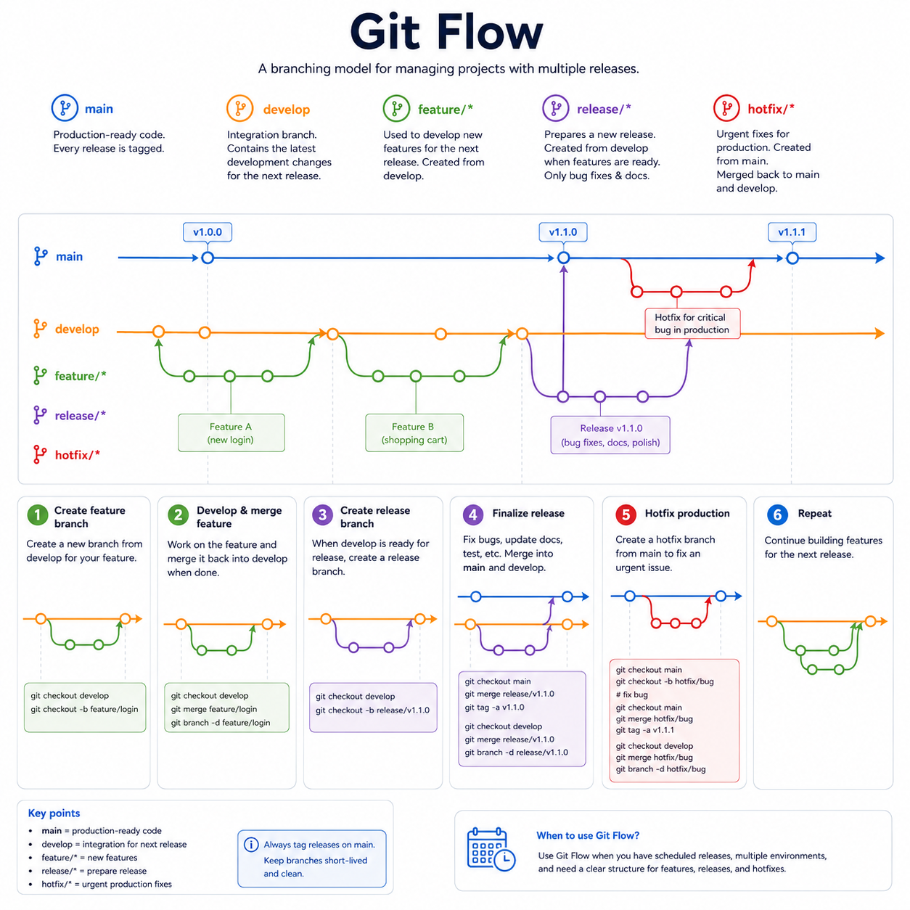

# recept-sida-git
En övning/inlämningsuppgift för git. 

Vi valde Git Flow som branchstrategi eftersom den är en av de mest etablerade och väl dokumenterade strategierna. Den ger en tydlig struktur med separata brancher för utveckling, funktioner och releaser, vilket gör det enklare att samarbeta i grupp och lära sig versionshantering på ett organiserat sätt. 

Trots att Git Flow kan vara mer omfattande än vissa andra strategier ansåg vi att den tydliga uppdelningen gjorde den lämplig för vårt projekt och vår inlärning.

Vi använder oss av en main branch, och en release branch som vi mergar till main och utgår från development. Varje team medlem använder sig av en feature branch och gör PR(pull request) som mergas till development. 